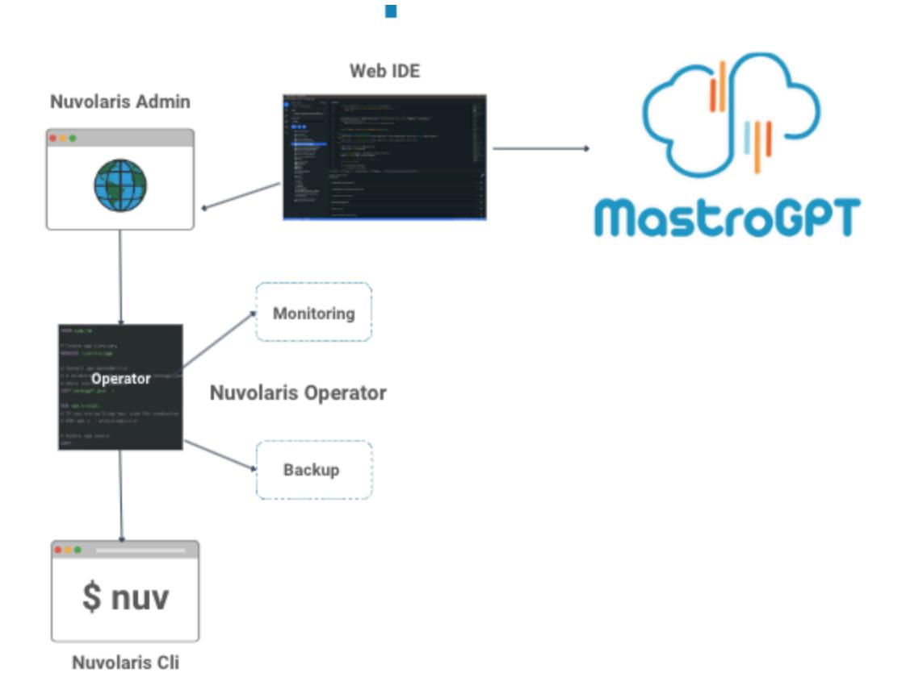

+++
title = "Nuvolaris Components"
description = "The Kubernetes operator, the CLI, the Console and MastroGPT — the management stack around OpenWhisk."
weight = 30
+++

Nuvolaris setup includes a comprehensive management stack for OpenWhisk and its services on Kubernetes, composed of a Kubernetes operator, a CLI, and a console for function development and management. Figure 3 depicts how each component contributes to seamless deployment, configuration, and operation.

**Figure 3**

## 1. Kubernetes Operator

- The Kubernetes operator is central to the automated deployment, configuration, and lifecycle management of OpenWhisk and its integrated services within a Kubernetes cluster.
- It deploys all core OpenWhisk components (Nginx, CouchDB, Kafka) as well as any required dependencies, ensuring compatibility and optimal configuration across services.
- The operator handles scaling, monitoring, and self-healing, automatically adjusting resources based on demand and redeploying components as needed for high availability.
- It simplifies configuration updates by managing custom resource definitions (CRDs) for each component, allowing easy adjustments to the entire stack.

## 2. CLI (Command-Line Interface)

- The CLI allows developers and administrators to interact directly with the Kubernetes operator and manage the serverless environment, providing fine-grained control over OpenWhisk functions and infrastructure.
- Through the CLI, users can invoke actions, manage triggers, and set rules while also interacting with the operator for tasks like deploying, scaling, or reconfiguring system components.
- The CLI includes commands for quick deployment and teardown, as well as commands to monitor the status of services, simplifying troubleshooting and system management.

## 3. Console

- The console offers a web-based platform for creating, managing, and deploying serverless functions, as well as launching development environments for rapid prototyping.
- Within the console, developers can write, edit, and test serverless functions, with syntax highlighting for languages like JavaScript, Python, and Go.
- The console's integrated launcher for **Web IDE** allows users to launch starter projects or templates for common serverless applications, with pre-configured boilerplate code to build LLM based applications. This supports fast setup and enables new developers to get up and running quickly.

## 4. MastroGPT

- MastroGPT is the AI development platform within Nuvolaris, designed to streamline the creation of AI applications.
- With MastroGPT, developers can start quickly using ready-made templates (or "starters") that cover popular AI use cases, helping teams launch projects rapidly.
- Applications built on MastroGPT can be deployed seamlessly across various environments, from private clouds to on-premises setups or even public clouds.

Together, the Kubernetes operator, CLI, the Console and MastroGPT offer a full-featured, integrated system for managing OpenWhisk. This combination provides flexibility for developers, operational control for administrators, and visibility into system performance, ensuring a smooth, efficient, and secure serverless environment.

Next: [Integrated Services](@/architecture/integrated-services.md).
