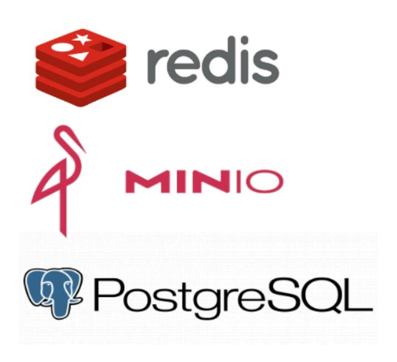
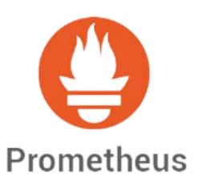
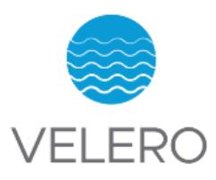

+++
title = "Integrated Services"
description = "Redis cache, MinIO or Ceph object storage, PostgreSQL and FerretDB, Prometheus monitoring and Velero backup."
weight = 40
+++

Nuvolaris includes a number of integrated services as shown in Figure 4.

**Figure 4**

## 1. Redis Cache

Redis (Remote Dictionary Server) is an open-source, in-memory data structure store primarily used as a cache and message broker. Redis is particularly well-suited for caching due to its low latency and high throughput, as it stores data directly in memory, unlike traditional databases that rely on disk storage.

In a serverless platform like Nuvolaris, Redis acts as a high-performance layer to cache dynamic content, optimises response times and improves overall application speed.

## 2. MinIO or Ceph Object Storage

We include an S3 storage using either MinIO or Ceph.

MinIO is an AGPL licensed open-source, Amazon S3-compatible object storage system designed for large-scale data infrastructure. It allows you to store unstructured data like photos, videos, backups, and log files in a highly scalable manner.

Ceph is a LGPL licensed open-source Amazon S3-compatible object storage, and can be used as an on-premise S3-compatible storage solution, ideal for private cloud environments or hybrid deployments.

In the Nuvolaris ecosystem, MinIO or Ceph provides a robust object storage solution that can be used to store application data, backups, and even static content, ensuring that data is both secure and accessible.

## 3. PostgreSQL and FerretDB Database

PostgreSQL, often referred to as Postgres, is an open-source relational database known for its extensibility, reliability, and SQL compliance. It is widely regarded as one of the most advanced databases available, especially within cloud-native ecosystems.

FerretDB is an open-source database that acts as a drop-in replacement for MongoDB, designed to work with PostgreSQL as its storage backend. It is ideal for users who want MongoDB-like functionality without the restrictions and licensing constraints of MongoDB, especially as MongoDB's licensing changes have impacted its use in certain environments.

In a Nuvolaris setup, PostgreSQL and FerretDB provides robust database services for handling application data that requires relational structure and advanced querying capabilities, which is particularly valuable for data-driven application.

## 4. Prometheus Monitoring

Prometheus is an open-source monitoring and alerting toolkit designed specifically for reliability and scalability in cloud-native environments. It collects and stores metrics data, offering visibility into system health and performance.

In Nuvolaris, Prometheus is essential for monitoring the health of services and infrastructure, enabling proactive incident response and resource optimization in a scalable, serverless environment.

## 5. Velero Backup

Velero is an open-source tool for managing Kubernetes backups, disaster recovery, and migration. It's designed specifically for Kubernetes clusters and provides reliable backup, restore, and migration of cluster resources and persistent volumes.

For Nuvolaris, Velero is vital in ensuring business continuity, providing peace of mind with automated backups and quick recovery options, reducing data loss risk and maintaining application availability in the case of accidental deletion, corruption, or failure.

Next: [Supported Clouds](@/architecture/supported-clouds.md).
