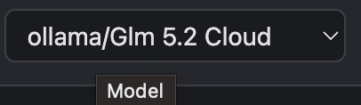
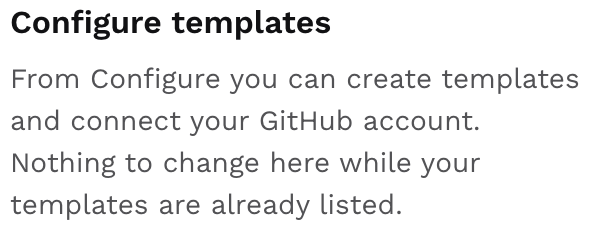
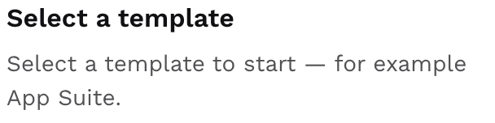
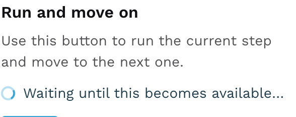
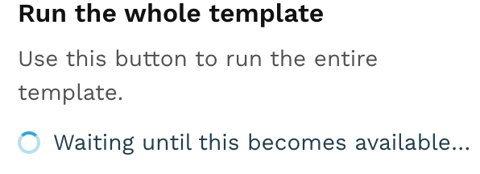
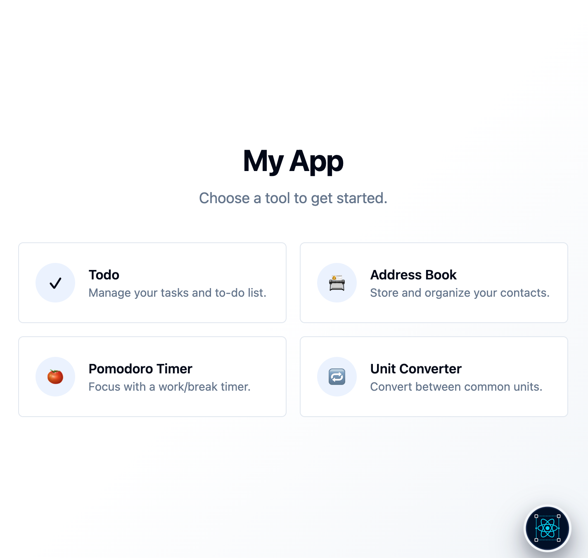

+++
Title = "Application chat"
+++

Menu

Select Agent

Select Model

New session

Resume session

Open template

Templates

Run next step

Run the all template

Chat

TruACP (Trustable Agent Control Panel)

Preview panel

Type select mode

