+++
title = "App Edit"
weight = 40
+++

Pressing **EDIT** on an application in the [App List](@/documentation/list/index.md)
opens the workbench — the screen where you actually build. Everything happens
here: you describe what you want on the left, and watch it appear on the right.

Edit App

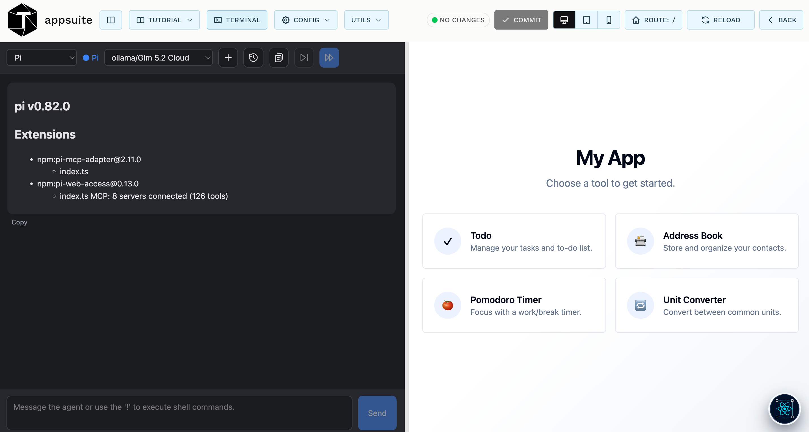

The workbench is a **toolbar over two panes**.

**The left pane** is the AI assistant, TruACP. It is a full conversation with the
coding agent — here it has just started, reporting `pi v0.82.0`, its loaded
extensions, and that 8 MCP servers with 126 tools are connected. Those tools are
what let the assistant do more than write text: query your database, read object
storage, deploy functions. At the bottom is the message box, which also runs shell
commands directly when you prefix them with `!`. See
[Application chat](@/documentation/chat/index.md).

**The right pane** is your application, running live — the real thing, not a
mockup. When the assistant changes code, this pane updates. Clicking through it
works exactly as it will for your users.

The divider between them can be dragged to give either side more room.

**The toolbar** splits in two: controls on the left act on the *assistant and the
application's configuration*; controls on the right act on the *preview and your
changes*. The sections below follow that order.

## Up left menu

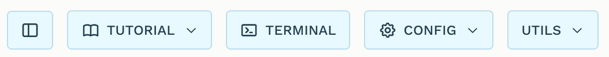

From left to right: the **sidebar toggle**, then the **TUTORIAL**, **TERMINAL**,
**CONFIG** and **UTILS** buttons.

## Hide chat

The panel icon hides and shows the assistant pane so the preview can take the
full width — useful when you want to look at your application properly rather
than at the conversation.

As the in-app tutorial puts it: *"This button hides and shows the assistant pane
on the left. Hiding it gives the preview the full width; your session keeps
running either way."*

That last point matters. The assistant is only hidden visually, never stopped —
nothing is reloaded and no conversation is lost, so you can toggle it as often
as you like. The choice is remembered between sessions.

## Tutorial

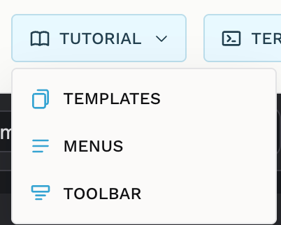

The **TUTORIAL** pulldown starts guided walkthroughs that spotlight each control
in place and explain it — the same explanations quoted throughout this page.
There are three:

- **TEMPLATES** — the prompt templates in the assistant pane, covered in
  [Templates](@/documentation/template/index.md).
- **MENUS** — the Config and Utils pulldowns.
- **TOOLBAR** — the right-hand group: Commit, the device preview, Route, Reload
  and Back.

The Templates tutorial needs the assistant pane visible, so if you have hidden
it the tutorial highlights the toggle first and waits for you to bring it back.

## Terminal

**TERMINAL** opens a real shell **inside your application's directory**, in a
pane below the two panes rather than replacing either of them. It is a genuine
terminal, not a command box: interactive programs, editors and long-running
processes all work.

Drag its top edge to resize it; the height is remembered. Closing the pane ends
the shell, so its visibility is deliberately not restored on the next visit.

## Config

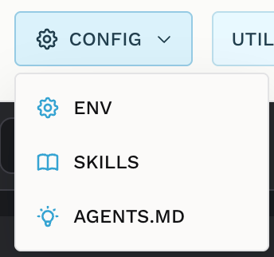

**CONFIG** holds the settings of the application you are editing — as the
tutorial says, *"its environment variables, the skills the assistant can use, and
its AGENTS.md."* Three entries:

### Env

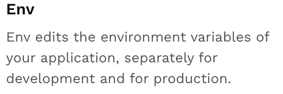

Opens the environment-variable editor, with separate **development** and
**production** values, exactly like the **ENV** button on the app list. This is
also where the launch process sends you when an application is missing a required
value, so a blocked launch can be fixed without leaving the workbench.

### Skills

**Skills** are ready-made abilities you add to the assistant for this
application — packaged instructions that teach it a particular job. Adding one
clones it into the application so the assistant picks it up.

### AGENTS.md

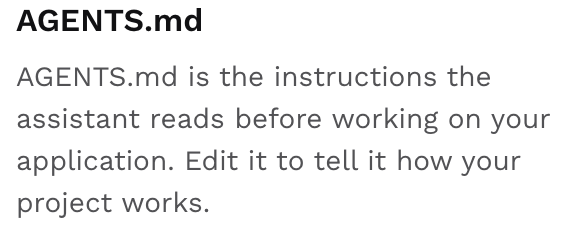

`AGENTS.md` is the **instructions file the assistant reads before doing anything**
in your application. It is where you record what the assistant cannot infer from
the code: conventions to follow, libraries to prefer, things never to touch.

Time spent here pays for itself — it is the difference between explaining your
project in every message and explaining it once. The entry opens an editor with
Save and Cancel; the file is created and added to Git if it does not exist yet.

## Utils

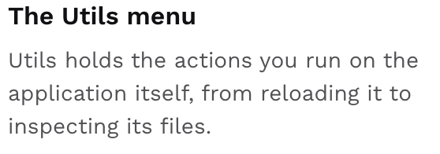

**UTILS** holds the actions you run against the application itself — *"from
reloading it to inspecting its files."* Seven entries, in order:

### Revert

**REVERT** discards every uncommitted change and returns the application to its
last commit. It is greyed out when there is nothing to revert — the same
condition that disables Commit — which is why the tutorial waits for it to become
available.

It asks for confirmation, and it means what it asks: reverting removes untracked
new files as well as edits. Anything not committed is gone.

### Reload and Redeploy

Two related actions, both in this menu:

- **RELOAD** refreshes the preview pane only. Nothing runs on the server. This is
  the cheap refresh for the usual case, where the dev server has already rebuilt
  in the background.
- **REDEPLOY** rebuilds on the server first — which is what you need after
  changing dependencies or configuration, since those are not picked up by a
  browser refresh. It runs a full cycle (stop the dev server, deploy the backend
  actions, list them, start the dev server, wait for it to answer) and reports each
  step in the preview pane as it goes.

Redeploy is in this menu on purpose: the toolbar reaches it only through a
modifier key, so this is the discoverable path to it.

### Clean

**CLEAN** removes the application's local build artefacts — the virtual
environment, `node_modules`, built archives — and nothing else.

Note what it does *not* do: it does **not** rebuild. Cleaning stops the dev
server, so the preview goes down and stays down until you redeploy; a plain
Reload cannot bring it back. The result panel therefore offers a **Redeploy**
button directly.

Use it when a build has got into a state you no longer trust and you want to
start from clean dependencies.

### Debug

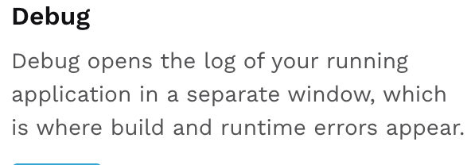

**DEBUG** opens a separate window streaming the live log of your running
application — where build errors, runtime exceptions and the output of your
backend actions actually appear.

When something does not work and the preview gives no clue, this is where to look
first. The log streams as it happens, and closing the window stops it.

### Files

**FILES** browses the application's source **read-only**: a file tree on the left,
content on the right, with a Copy button and a Refresh for the tree.

It is for reading what the assistant has written — reviewing a change, checking
where something lives — without leaving Trustable. There is deliberately no edit,
create, rename or delete: editing happens through the assistant or the terminal.
Content is always shown as plain text, so markdown appears as its source rather
than rendered.

### Upload

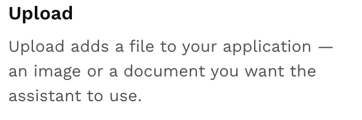

**UPLOAD** puts a file into your application — an image, a PDF, a dataset — so the
assistant can work with it. After the upload Trustable shows the full path and
lets you copy it, which is what you paste into your next message to point the
assistant at the file.

## Up right menu

The right-hand group: the **git status pill**, **COMMIT**, the three device
buttons, **ROUTE**, **RELOAD** and **BACK**.

## Commit

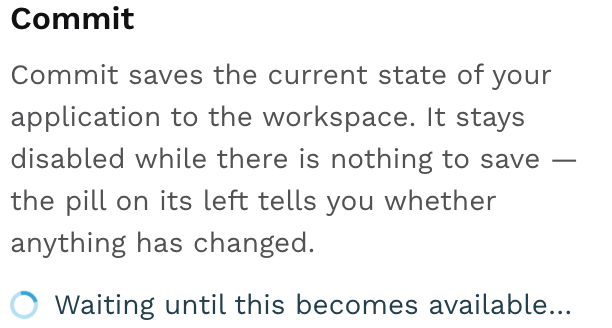

The pill and the button work together, and this pair is the most important thing
on the toolbar.

The **status pill** polls the application every ten seconds and reports it:
**NO CHANGES** with a green dot when everything is saved, or an orange dot with a
summary like *"3 changed, 1 added, 2 deleted"* when it is not.

**COMMIT** saves the current state of the application into its durable
repository, and is disabled while there is nothing to save.

Committing is not optional housekeeping. The working copy the assistant edits is
**temporary** — it does not survive a restart of the application, and uncommitted
work is permanently lost when that happens. Committing is the only way to keep
it. Commit whenever the application reaches a state you would be unhappy to lose.

## Previews

Three segmented buttons — **desktop**, **tablet**, **phone** — constrain the
preview to a device viewport: tablet at 820×1180, phone at 390×844. Desktop fills
the pane with no frame.

The device frames scale down to fit the pane, but the scaling is visual only: the
preview still reports the *true* device width to your application, so its own
responsive rules fire exactly as they would on the real hardware. That is the
whole point — a shrunken desktop layout would tell you nothing.

Your choice is remembered between sessions.

## Route

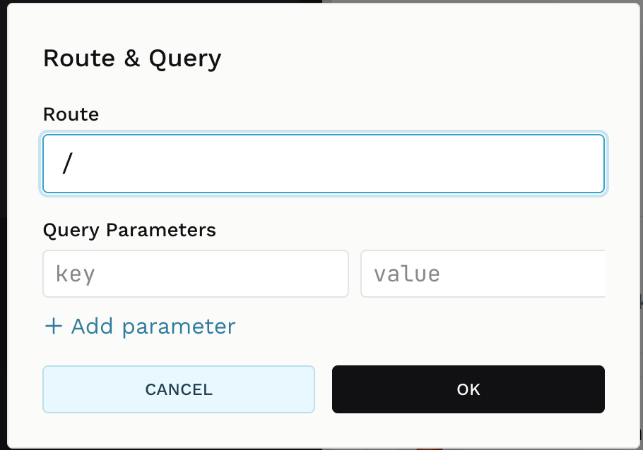

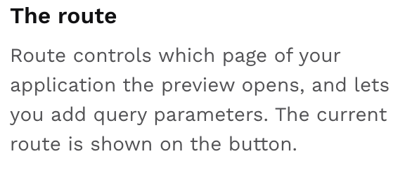

The **ROUTE** button shows which page the preview is on — `ROUTE: /` for the home
page — and clicking it opens the **Route & Query** dialog.

- **Route** — the path the preview opens at. Set it to `/settings` to work on
  that page directly instead of clicking your way there after every reload.
- **Query Parameters** — key/value pairs appended as a query string. **+ Add
  parameter** adds a row; each row has a × to remove it. Rows with an empty key
  are ignored.

**OK** applies both and reloads the preview at the new address; **CANCEL** leaves
everything untouched. Your choice persists, so reloads keep landing on the page
you are working on.

## Reload

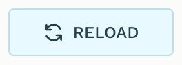

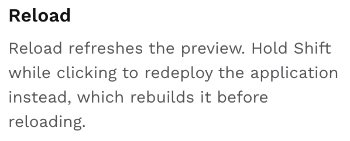

**RELOAD** refreshes the preview, keeping the current route and query and busting
the cache. No server call, no waiting.

### Press shift to get redeploy

Hold **Shift** and the same button becomes **REDEPLOY** — rocket icon and all —
running the full server-side rebuild described under Utils above.

The label changes *while you hold the key*, before you click, so the modifier is
visible rather than hidden. Both actions are also in the Utils menu if you would
rather not use the modifier.

## Back

**BACK** leaves the workbench and returns to the application list, stopping the
application's processes on the way out.

If you have uncommitted changes it warns you first, under the heading *"Uncommitted
Changes"*, offering **Go back anyway** and **Cancel**. Leaving is not itself
destructive — it only stops the running processes — but the working copy does not
survive a restart, so uncommitted work will be lost the next time the application
is launched. The warning is about that risk, not about the navigation. If in
doubt, Cancel and Commit first.

## Next

- [Application chat](@/documentation/chat/index.md) — the assistant in the left pane.
- [Templates](@/documentation/template/index.md) — reusable multi-step prompts.
