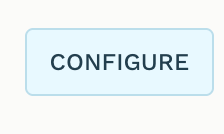
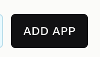
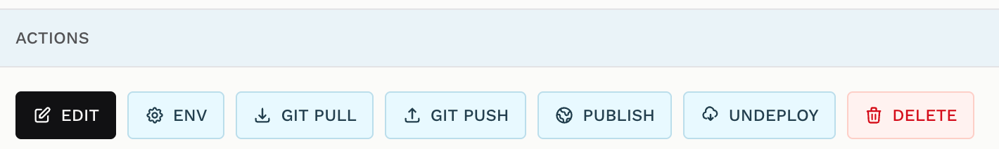
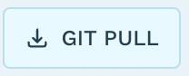
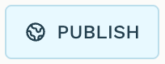
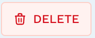

+++
title = "App List"
weight = 30
+++

The application list is Trustable's home screen. Everything you build lives here,
and every action that operates on a whole application — open it, edit its
environment, sync it with GitHub, publish it, remove it — starts from this page.

List application

The page has four bands.

**The header** carries the Trustable logo, the product name, and a compact
release tag — `V0.4.0 · MAIN` above — giving the version and the build stream it
came from. Hovering it reveals the exact source branch and build label, which is
how you tell a local build from a development or release image. At the far right
sit the two global buttons, **CONFIGURE** and **ADD APP**.

**The summary row** counts four things at a glance:

- **APPLICATIONS** — how many you have in total.
- **PRODUCTION** — how many are configured for production, i.e. have a cluster to
  publish to.
- **DEVELOPMENT** — how many exist only locally so far.
- **REPOSITORIES** — how many have a Git repository behind them.

**The Applications card** — labelled *WORKBENCH INVENTORY* — is the list itself,
with its search box, sort selector, view switch and filters. The count under the
heading (*"1 application"*) always reflects what the current search and filter
actually show.

**The footer** reports the build identifier and the expiry date of this Trustable
version, plus a short hash identifying the ops task set in use. Trustable builds
carry an expiry; past it, the app asks you to update.

> When your provider is **Sovereign AI**, a **Credits** pill appears just under
> the title showing your remaining balance, refreshed every minute. With any other
> provider there are no credits to track and the pill is not shown.

## Configure button

Opens the [Configuration](@/documentation/config/index.md) page — provider, models,
license, Git identity and shared environment values. It is workbench-wide
settings, not per-application ones; those live behind each row's **ENV** button.

## Add applications

**ADD APP** opens the *Add Application* dialog. There are two ways to get a new
application, presented as tabs: start from a **Starter** — an empty but correctly
wired skeleton you then describe to the AI — or pick a **ready-made application**
from the catalog and adapt it.

### Starter

The **STARTER** tab is the default. It offers a short radio list of starters —
minimal, convention-compatible repositories maintained for Trustable — each with
its name as a link to its GitHub page and a one-line description:

- **truchat** — AI chat UI with RAG.
- **trudemo** — collection of demos.
- **trureact** — a generic React starter.
- **My Application Starter** — always the last row, for using a repository of
  your own rather than a published starter.

Below the list:

- **Application Name** — the name of the new application, and the identity it
  keeps everywhere: its repository, its workspace, its URL. It must be **6–20
  alphanumeric characters starting with a letter**, as the hint says, and it must
  not collide with an application you already have.
- **GitHub Repository** — in `org/repo` form. It is prefilled from the starter you
  selected and is where the code comes from. Choosing **My Application Starter**
  is what makes this field yours to fill in; it is also the case where a private
  repository may need a connected GitHub account, so the dialog offers to connect
  one there.

**CREATE** creates the application: Trustable clones the starter into a durable
repository of its own for this app, registers it, and returns you to the list. If
the starter declares environment variables with no value, Trustable asks you to
fill them in before going further.

Starters are discovered from a published index rather than by querying GitHub, so
the list is identical on every installation. If it cannot be loaded, the dialog
says so and leaves *My Application Starter* available, so you are never stuck.

### Chat

The remaining tabs — **CHAT**, **DEMO**, **EXAMPLES**, **UTILITIES** — browse the
catalog of complete, working applications. Each tab is one group, shown as a
carousel: **one application at a time**, with its **title** at the top linking to
its GitHub repository, a **screenshot** in the middle, and its **description**
underneath.

The **‹** and **›** arrows step through the group and wrap around at both ends;
the arrow keys do the same. The **"1 of 3"** counter tells you how far along you
are. A group holding a single application shows neither arrows nor counter.

The Chat group collects conversational applications — here **AI Database
Manager**, an interface that turns plain-language questions into live PostgreSQL
work.

Clicking anywhere on the card except the title link opens a small **name panel**:
it names the application and the repository it will be created from, prefills an
**Application Name**, and offers Cancel and Confirm. The prefilled name is only a
starting point — you can edit it freely, and if the obvious name is taken
Trustable appends the smallest free number (`tetris`, `tetris1`, `tetris2`).
**Cancel returns to the carousel** rather than closing the dialog, because you are
choosing, not aborting.

### Demo

**DEMO** holds showcase applications demonstrating what Trustable can build —
here **AI CRM**, a contact-and-ticket dashboard.

### Examples

**EXAMPLES** holds worked examples you can learn from or build on — here **API
Status Monitor**, which polls endpoints and records uptime, response times and
check history.

### Utilities

**UTILITIES** holds practical tools — here **Document Ingest**, which uploads PDFs
and runs them through an ingestion pipeline so an AI application can search them.

An application can be listed under more than one group. Whichever tab you create
it from, it is created from **that entry's own repository**, so two entries in the
same group give you two genuinely different applications.

> Switching tabs never loses what you typed elsewhere: the Starter tab keeps its
> selection and name. Reopening the dialog always resets to Starter.

## Application

The **APPLICATION** column identifies each application: a colour-coded initials
badge, the application name, and — when it is running — a **DEVELOPMENT** link
that opens the live local application in a new tab. That link is how you look at
what you are building outside the editor.

## Filters

Three segmented filters restrict what the list shows. They combine with the search
box, and the *"N applications"* count follows both.

### All

**ALL** — the default. Every application, whatever its state.

### Production

**PRODUCTION** — only applications configured for production, meaning they have a
cluster host, user and credentials recorded and can be published.

### Development only

**DEVELOPMENT ONLY** — the complement: applications that exist only locally and
have never been given a production target. Useful for spotting work that is ready
to ship but not yet configured.

## Search

The controls above the filters:

- **Search apps or repositories** — filters as you type, entirely in the browser
  with no round trip to the server. It matches the application name, the
  repository, and the production host and user, so you can find an application by
  where it is deployed as well as by what it is called.
- **Name** — the sort selector; sort by application name or by repository.
- **GRID / LIST** — the view switch. **LIST** is the default dense table.

## Grid

**GRID** shows each application as a card instead of a table row. The card carries
the same information laid out vertically: the initials badge and name, the
repository link, state chips (*Development*, *REPO*), then two wide buttons for
the environments — **DEVELOPMENT**, which opens the running local application, and
**NO PRODUCTION**, which is inert here and simply reports that this application has
no published deployment yet. The actions sit at the bottom of the card.

Grid is the better view when applications have screenshots or you are scanning a
handful of them; List is better once you have many.

## Repository

The **REPOSITORY** column shows the GitHub repository backing the application, as
`org/repo`, linked to its GitHub page. This is the code's public home — the target
of Git Pull and Git Push — as distinct from the durable local copy Trustable keeps
for itself.

## Status

The **STATUS** column reports which of the two states the application is in:
**DEVELOPMENT** when it exists only locally, **PRODUCTION** once it has been
published to a cluster and is serving real users.

## Action

The **ACTIONS** column carries every per-application operation. They are described
one by one below, in the order they appear.

## Edit

**EDIT** is the main one — it opens the application in the workbench editor, where
you talk to the AI assistant and watch your application update live. See
[Editing](@/documentation/edit/index.md).

Clicking it *launches* the application, which is real work: Trustable checks the
code out into a working area, regenerates its configuration files, logs in to the
cluster, installs dependencies and starts the development server. A progress bar
tracks the actual lifecycle stages rather than a timer, so it reflects genuine
progress; if a stage fails, the bar stops where it got to and the error is shown.

Clicking Edit again — from this tab or another — is safe. Trustable reuses a
runtime that is already healthy instead of starting a second one.

## Env

**ENV** opens the environment editor for this application: a table with a
**VARIABLE** column and separate **Development** and **Production** values, so one
application can point at a test database locally and the real one in production.

Four rows are fixed and cannot be removed:

- **OPS_APIHOST** — the cluster the application publishes to.
- **OPS_USER** and **OPS_PASSWORD** — its credentials on that cluster.
- **OPS_REPO** — its production repository, initialized from the Git origin.

For these, the development value is managed by Trustable and read-only; the
production value is yours to set. Below them you add and remove your own
variables freely.

**Import `.env`** and **Import `.env.production`** fill a column from a local file,
parsed in the browser. Neither import writes anything until you press **Save**,
which writes both files; **Close** warns you if changes are pending.

> Values you keep in [Predefined Environment Variables](@/documentation/config/index.md)
> are offered here through a **Use predefined values** button when a required
> variable has no value. Nothing is copied in without you confirming it.

## Git Pull

**GIT PULL** brings changes from GitHub into Trustable — work done elsewhere, by a
teammate or by you on another machine.

It pulls from the configured production repository when there is one, and from the
application's original origin otherwise, then updates both Trustable's durable copy
and, if the application is checked out, the working copy.

The pull is deliberately **conservative**: it never merges, rebases, hard-resets or
overwrites uncommitted work. If you have local changes or the histories have
diverged, it stops and tells you, leaving your work untouched — commit or set your
changes aside first, then pull again.

When the pull did change the checked-out copy, Trustable asks whether you want to
**deploy** as well, since fresh code usually needs redeploying to take effect.
Declining changes nothing.

## Git Push

**GIT PUSH** sends your committed work to GitHub — the reverse of Git Pull.

The first push for an application needs a target, so Trustable asks for the
**production repository** in `org/repo` form. The same dialog offers to connect
your GitHub account, which is the recommended path: Trustable then pushes over
HTTPS using the connection, with no key to manage. If you would rather not connect
an account, a collapsed *"Use an SSH deploy key instead"* option reveals a key you
can add to the repository's deploy keys with write access.

Once configured, the repository is remembered and later pushes go straight through.
Trustable pushes the repository's own default branch rather than assuming `main`.

> Git Push requires a valid **license**. Without one, Trustable offers to install
> a license rather than failing silently. See
> [Configuration](@/documentation/config/index.md#license).

## Publish

**PUBLISH** deploys the application to your OpenServerless cluster and moves it
into the *Production* state, reachable at its own URL by real users.

The first publish asks for the cluster details — **OPS_APIHOST**, **OPS_USER** and
**OPS_PASSWORD** — since Trustable cannot guess where you want it to run. The
dialog notes that you need an OpenServerless environment, and points at
[info@nuvolaris.io](mailto:info@nuvolaris.io) or the
[OpenServerless project](https://openserverless.apache.org) if you do not have one.

With the target known, Trustable prepares a clean checkout, generates the
production environment files, logs in to the cluster in production mode, and
deploys. Later publishes skip straight to the deployment.

> Publish requires a valid **license**, and the license must cover the specific
> cluster host you are publishing to — a valid license for one cluster does not
> authorize another. Local development clusters are exempt from the host check but
> still need a valid license.

## Undeploy

**UNDEPLOY** is the counterpart of Publish: it removes the application's deployed
actions and packages from the cluster, taking it out of production.

It is deliberately narrow. Your code, your local repository, your configuration and
the application's entry in this list are all untouched — only the running
deployment goes away, and you can publish again at any time. Because of that
narrowness it needs no license.

A confirmation modal asks *"Undeploy `<name>`? This removes its deployed actions
and packages."* before anything happens, and the command output is shown when it
finishes.

> Undeploy runs inside the application's checked-out copy using cluster
> credentials, so an application that has never been opened has nothing to undeploy
> from: Trustable replies *"workbench not found — launch the app first."*

## Delete

**DELETE** removes the application from Trustable — its entry, its local repository
and its checkout. It is styled in red because it is the only genuinely destructive
action on this page and, unlike Undeploy, it does not leave the source behind.

Anything you have pushed to GitHub survives, since Delete acts on Trustable's copy
rather than on the remote repository. Anything you have **not** pushed is gone. If
the work matters, Git Push before you delete.

## Next

- [Editing](@/documentation/edit/index.md) — what the **EDIT** button opens.
- [Configuration](@/documentation/config/index.md) — what **CONFIGURE** opens.
