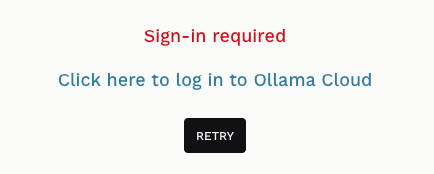
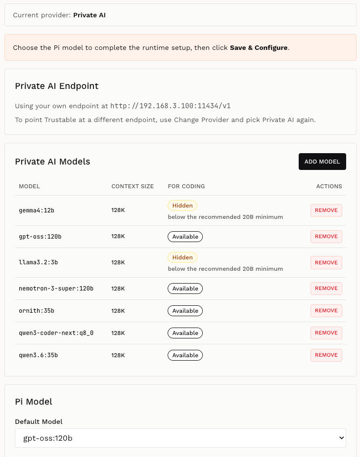

+++
title = "Setup"
weight = 10
+++

The very first time you open Trustable you land on the splash screen. Before you
can create an application, Trustable needs to know **which AI provider powers
the assistant** — the model that turns your descriptions into working code.

This is the only mandatory setup step. Everything else has a sensible default.

## Choosing a provider

The **Select your AI provider** screen offers three ways to get a model, and the
difference between them is *where the model runs and who pays for it*:

| Card | What it is | You need |
|---|---|---|
| **Cloud AI** | Subscription-based AI, powered by Ollama Cloud. Trustable talks to its own built-in Ollama server, which forwards to Ollama's cloud models. | A free Ollama Cloud account |
| **Sovereign AI** | Credit-based AI, powered by [Regolo.AI](https://regolo.ai) — models hosted in the EU. | A Trustable AI account (100 free credits on sign-up) |
| **Private AI** | Any OpenAI-compatible endpoint you run yourself. Nothing leaves your infrastructure. | The URL of your own endpoint |

Whichever you pick, the choice is saved in your workspace configuration and
Trustable goes straight to the application list next time. You can change it
later from the Configure page — see [Configuration](@/documentation/config/index.md).

Once a provider is selected, Trustable runs a short **configuration pass**: it
pulls the models it needs (for Cloud AI), writes the runtime configuration for
the Pi coding agent, and finishes with a live *"Reply with exactly: OK"* probe
against the model. Only when that probe succeeds are you let through to the
application list — an unusable model would make the whole workbench useless, so
a failed check always sends you back to this screen.

## Cloud AI

Cloud AI is the fastest way to start. Trustable uses the Ollama server bundled
inside it, and that server forwards your requests to Ollama Cloud's large
models, so you get cloud-class quality without installing anything or managing
a GPU.

Signing up for Ollama Cloud is free and includes a free allowance you can
upgrade later. There is nothing to type into Trustable — no URL, no API key.
Instead, you pair this machine with your Ollama account once.

### Sign in to Ollama Cloud

The first configuration attempt is expected to fail if you have never paired
this device. Trustable detects the authentication failure and shows:

**Sign-in required.** Trustable has run `ollama signin` in the background and
scraped the pairing URL out of it. Click **"Click here to log in to Ollama
Cloud"** — it opens in a new tab, so this page stays where it is.

> If Trustable cannot find a pairing URL, it shows a different message asking you
> to run `ollama signin` yourself in a terminal and then click **Retry**.

### Connect the device

The Ollama page asks you to confirm your account and pair this specific machine.
The two names shown are the **host** and the **cluster** Trustable is running on,
so you can tell one installation from another. Click **Connect**.

**Device Connected Successfully.** The identity is now stored in the Trustable
workspace, so it survives restarts — you only do this once per installation.
Close this tab.

### Back in Trustable: press Retry

Return to the Trustable tab and click **Retry**. The configuration pass reruns,
now authenticated, and streams its progress:

- `Pulling model …` / `OK: … pulled` — one line per model in the recommended
  Cloud AI set, being fetched into the local Ollama server.
- `OK: Pi global configuration written` — the coding agent now knows which
  provider, endpoint and models to use.
- `Testing AI model connection…` followed by
  `OK: AI model connection successful` — the live probe passed.

Click **CONTINUE** to reach your application list. Setup is done.

## Sovereign AI

Sovereign AI routes your requests through Regolo.AI, an EU-hosted inference
provider, and bills them as **credits** rather than a subscription. Registering
gives you 100 credits free, which is enough to build and iterate on a first
application.

Choosing this card opens the Trustable AI registration page **inside Trustable**,
as an overlay. When you finish, that page hands the endpoint and API key straight
back to Trustable — you never copy and paste a key.

### Sign in

If you already have a Trustable AI account, use the **Sign in** tab to retrieve
your API key. The same page carries **Forgot password?** and **Top up your
account** links; topping up is also reachable later from inside the workbench
when your credits run low.

### Register an account

Otherwise switch to **Create account**. The form asks for your name, email,
phone (with country code), a password of at least 8 characters, and optionally
your company and LinkedIn. You must accept the Privacy Policy and pass the
human-verification check, then click **Send verification code** and confirm the
code sent to you.

The password matters beyond sign-up: it is what you use later to sign in again
and **recover your API key**.

When registration completes, the overlay closes on its own, Trustable saves the
returned endpoint and key, and runs the configuration pass. For Sovereign AI
there are no models to pull — the models are remote — so only the *"Reply with
exactly: OK"* probe runs, and it is quick.

> If the probe ever fails later (an expired or exhausted key, for instance),
> Trustable reopens this same registration overlay so you can sign in again, then
> retries automatically.

## Private AI endpoint

Private AI is the option for **your own hardware**: an Ollama server on your
network, a vLLM deployment, a llama.cpp server, or any other service that speaks
the OpenAI-compatible API. Nothing about your prompts or code leaves the machines
you control, and there is no per-token cost.

The dialog asks for two things:

- **Base URL** — required. It must end in `/v1`, the OpenAI-compatible API root,
  and match the shape `http(s)://…/v1`. Trustable refuses to save anything else,
  because a wrong URL would otherwise fail much later in a confusing place.
- **API key** — optional. Many self-hosted endpoints need none; that is exactly
  the case this card is named for.

A typical entry is a plain `http://` address on your LAN, like an Ollama server
listening on port `11434`. Because it is `http://` and unauthenticated, it saves
with no further questions.

> If you enter an **`https://`** URL and leave the API key empty, Trustable asks
> you to confirm — a public HTTPS endpoint almost always requires a key, so an
> empty one is usually a mistake rather than a choice.

### Model discovery

When you click **SAVE**, Trustable immediately queries the endpoint for its model
list rather than trusting the URL blindly. On success it reports how many models
it found and tells you the one remaining step. A broken endpoint, or one that
returns no models at all, is reported right in the dialog and is **never saved**.

### Choose the default model

Trustable then takes you to the Configure page with a banner: *"Choose the Pi
model to complete the runtime setup."*

Unlike Cloud AI and Sovereign AI, a private endpoint carries no catalog telling
Trustable which of its models is good at writing code. Picking one automatically
would silently select an embedding or a tiny model and fail confusingly later, so
**Trustable deliberately makes no guess** and asks you.

The screen shows:

- **Private AI Endpoint** — the URL in use. To point at a different endpoint,
  use *Change Provider* and pick Private AI again.
- **Private AI Models** — every model discovered at the endpoint, with its
  context size and a **FOR CODING** verdict. Models are marked either
  `Available`, or `Hidden` with the reason — typically *"below the recommended
  20B minimum"*, since small models cannot reliably drive the coding agent.
  **ADD MODEL** lets you declare a model the endpoint did not advertise, and
  **REMOVE** drops one from the list.
- **Pi Model → Default Model** — the dropdown where you pick the model the
  coding assistant will use. Only `Available` models are offered.

Click **SAVE & CONFIGURE** to finish. Trustable writes the configuration, runs
the *"Reply with exactly: OK"* probe against the model you chose, and — when it
answers — takes you to the application list.

> The button is blocked while no default model is selected; Trustable tells you
> *"Please select the default model before saving."*

## Next

With a provider configured, continue to the [App List](@/documentation/list/index.md)
to create your first application, or to
[Configuration](@/documentation/config/index.md) to review models, credits and
per-application settings.
