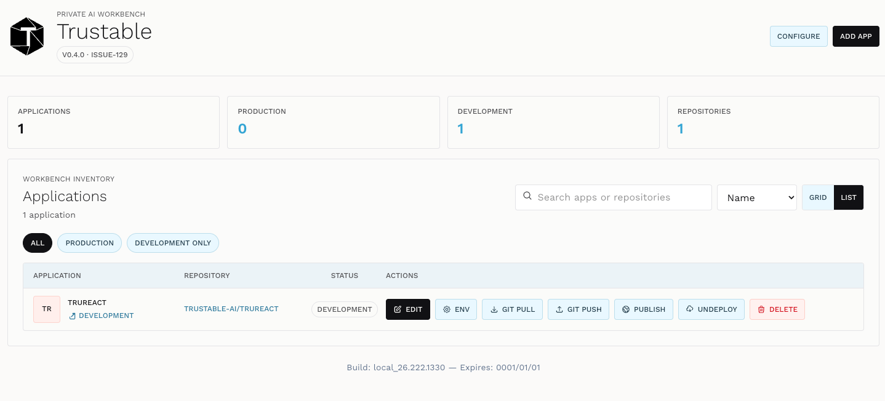
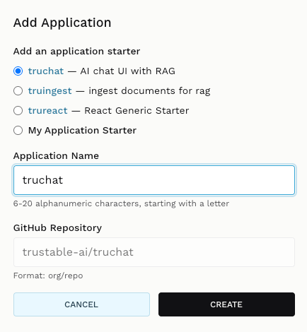

+++
title = "Application List"
description = "Create applications from a starter, browse what you have, and use the per-application actions."
weight = 2
+++

The application list is the home screen of the Trustable workbench. It shows
everything you have built, what state each application is in, and gives you the
actions to edit, run, publish and remove them.

## List applications

### Header

The top bar carries the Trustable mark, the version and build identifier
(`V0.4.0 · ISSUE-129` in the screenshot), and two actions:

- **Configure** — provider and model settings. See
  [Choose Provider](@/manual/provider/index.md).
- **Add App** — create a new application. See [Add application](#add-application)
  below.

### Summary counters

Four counters give you the state of the workbench at a glance:

| Counter | What it counts |
| --- | --- |
| **Applications** | Every application registered in the workbench. |
| **Production** | Applications currently published and serving on your cluster. |
| **Development** | Applications checked out and running locally for editing. |
| **Repositories** | Git repositories backing those applications. |

An application can be counted in both Production and Development at once: the
published version keeps serving while you iterate on the next one.

### Workbench inventory

Below the counters is the list itself, with the tools to navigate it:

- **Search** — filters by application name or repository, useful once the list
  outgrows a single screen.
- **Sort** — orders the list; **Name** is the default.
- **Grid / List** — switches between a card view and the dense table shown here.
- **All / Production / Development only** — filters by state, so you can see
  just what is live or just what is in progress.

### The application row

Each row describes one application:

- **Application** — its name (`TRUREACT` in the screenshot) with its current
  state linked underneath.
- **Repository** — the git repository backing it, for example
  `TRUSTABLE-AI/TRUREACT`. Click through to the repository itself.
- **Status** — `DEVELOPMENT` or `PRODUCTION`.
- **Actions** — everything you can do to this application.

### Actions

| Action | What it does |
| --- | --- |
| **Edit** | Opens the application in the workbench with the AI assistant, so you can describe changes and have Trustable make them. This is the main way you work. |
| **Env** | Edits the application's environment variables, separately for development and production — API keys, connection strings, feature flags. |
| **Git pull** | Fetches changes from the remote repository into your copy. Use it when someone else, or another machine, has pushed work. |
| **Git push** | Sends your committed changes up to the remote repository. This is source control, not deployment — pushing does not make the application live. |
| **Publish** | Deploys the application to your cluster and makes it reachable in production. This is what moves an application from Development to Production. |
| **Undeploy** | Takes the application out of production. The code and repository are untouched; only the running deployment is removed. |
| **Delete** | Removes the application from the workbench. Destructive — check that anything you want to keep has been pushed to its repository first. |

The distinction worth remembering: **Git push** protects your work, **Publish**
exposes it to users. They are independent, and you will usually do both.

### Footer

The footer shows the build identifier and expiry of the running Trustable
instance, for example `Build: local_26.222.1330 — Expires: 0001/01/01`. Quote
these when reporting a problem.

---

## Add application

**Add App** opens the creation dialog.

### Add an application starter

A starter is a working application that Trustable copies as your starting point,
so you begin from something that already runs rather than an empty directory.

| Starter | What you get |
| --- | --- |
| **truchat** | An AI chat UI with RAG — a conversational interface that answers from your own documents. |
| **truingest** | Document ingestion for RAG — the pipeline that loads, splits and indexes your documents so something like `truchat` can search them. |
| **trureact** | A generic React starter — a plain application skeleton for when you are building something that is not primarily a chat interface. |
| **My Application Starter** | Your own starter, when you have a template of your own to begin from rather than one of the supplied ones. |

`truingest` and `truchat` are designed to be used together: ingest your
documents with the first, then ask questions about them with the second.

### Application Name

The name of your application in the workbench, and the basis for its URL when
published.

- **6–20 alphanumeric characters, starting with a letter.**
- Defaults to the name of the starter you selected, which you can overwrite.
- Choose something distinct — this is what you will be scanning the list for
  later.

### GitHub Repository

The repository that will back the application, in `org/repo` format, for example
`trustable-ai/truchat`. Trustable uses it as the durable home for your code: it
is what **Git pull** and **Git push** talk to, and what survives if you delete
the local workbench copy.

### Create

**Create** sets up the repository, copies the starter into it and adds the
application to the list, ready to open with **Edit**. **Cancel** discards
everything and returns to the list.

---

## A typical first session

1. Configure a provider — see [Choose Provider](@/manual/provider/index.md).
2. **Add App**, choose `truchat`, name it, and **Create**.
3. **Edit** it and describe the changes you want in plain language.
4. **Git push** to save your work to the repository.
5. **Publish** when it is ready for real users.

Back to [Home](/).
