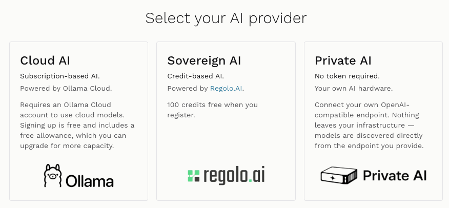
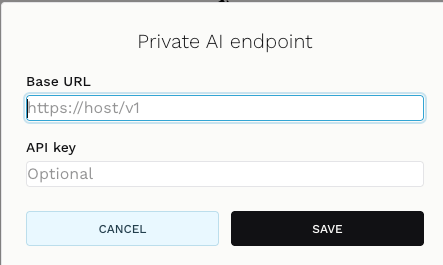
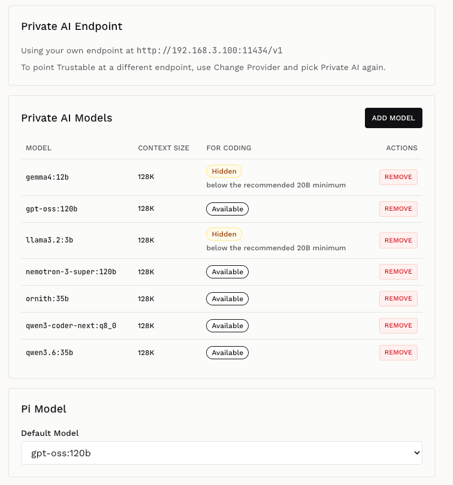

+++
title = "Choose Provider"
description = "Pick between Cloud AI, Sovereign AI and Private AI, connect your endpoint, and choose which models Trustable uses."
weight = 1
+++

The **provider** is the AI service that powers Trustable's coding assistant and
the applications you build. It is the first thing you configure, and you can
change it at any time from the **Configure** button in the workbench.

Trustable offers three providers. They differ in one dimension that matters
more than the rest: **where your prompts and data go**.

## Cloud AI

**Subscription-based AI, powered by Ollama Cloud.**

The quickest way to start. Trustable talks to Ollama's hosted models, so you get
capable large models without owning any hardware.

- Requires an Ollama Cloud account.
- Signing up is free and includes a free allowance, which you can upgrade for
  more capacity.
- Best when you want to try Trustable immediately, or when your workstation
  cannot run a model large enough for coding.

Your prompts leave your machine and are processed by Ollama Cloud.

## Sovereign AI

**Credit-based AI, powered by Regolo.AI.**

A managed AI provider operating under a defined jurisdiction, for teams that
need models hosted outside their own infrastructure but still under known legal
and geographic control.

- Billed in credits rather than a subscription.
- **100 credits free when you register.**
- Best when you cannot self-host, but a generic cloud provider is not acceptable
  for compliance reasons.

## Private AI

**No token required. Your own AI hardware.**

The fullest expression of what Trustable is for. You point Trustable at any
OpenAI-compatible endpoint you control — a local Ollama, a GPU server in your
rack, or an in-house inference gateway.

- **Nothing leaves your infrastructure.** Prompts, code and data stay inside
  your network.
- Models are **discovered directly from the endpoint you provide** — Trustable
  does not maintain its own list.
- No account, no token, no per-request billing.

This is the option to choose if you are running Trustable on a NuvolarIA
appliance, on your own server, or anywhere you already have inference capacity.

---

## Configuring Private AI

Choosing Private AI asks for the endpoint to use.

## Select endpoint

Two fields:

- **Base URL** — the OpenAI-compatible API root of your inference server, for
  example `http://192.168.3.100:11434/v1` for an Ollama instance on your LAN, or
  `https://host/v1` for a gateway you host. Include the `/v1` suffix; that is
  the path Trustable calls.
- **API key** — **optional**. Leave it empty for a local Ollama or any endpoint
  that does not authenticate. Fill it in if your gateway requires a bearer
  token.

**Save** stores the endpoint and immediately queries it for the list of
available models. If the endpoint is unreachable or the URL is wrong, saving
fails and you stay on this dialog — nothing is written until Trustable has
actually talked to the server.

**Cancel** leaves the current provider untouched.

## Select model

Once the endpoint is connected, Trustable shows what it found there and lets you
decide how each model is used.

### Private AI Endpoint

A header confirming which endpoint is in use, for example
`http://192.168.3.100:11434/v1`. To point Trustable at a different server, use
**Change Provider** and pick Private AI again — re-entering the dialog is how
you edit the URL.

### Private AI Models

The table lists every model discovered at the endpoint:

| Column | Meaning |
| --- | --- |
| **Model** | The model identifier as the endpoint reports it, for example `gpt-oss:120b` or `qwen3-coder-next:q8_0`. |
| **Context size** | How much text the model can consider at once. Larger contexts let the assistant hold more of your codebase in view while it works. |
| **For coding** | Whether Trustable will offer this model to the coding assistant. |
| **Actions** | **Remove** takes the model out of Trustable's list. It does not delete it from your endpoint. |

**Available** means the model is large enough to be used for coding and will
appear where you choose a coding model.

**Hidden** means Trustable will not offer it for coding, with the reason shown
underneath — typically *below the recommended 20B minimum*. Smaller models
answer quickly but tend to produce code that does not run, so Trustable keeps
them out of the way rather than letting you pick one and be disappointed. They
remain listed, and remain usable by your applications for lighter tasks such as
classification, extraction or chat.

**Add model** registers a model by name that the endpoint exposes but did not
report in its catalogue — useful for gateways with an incomplete `/models`
listing.

### Pi Model

**Default model** selects which model Trustable's assistant uses by default when
it builds and edits your applications. Only models marked *Available* appear
here. In the screenshot the default is `gpt-oss:120b`.

Pick the largest coding-capable model your hardware runs comfortably: this
single choice has more effect on the quality of what Trustable builds than any
other setting on this page.

---

## Changing provider later

Nothing here is permanent. **Configure → Change Provider** returns you to the
three-card chooser, and picking a provider again walks you through the same
steps. Existing applications are not affected — the provider governs how new
work is generated, not what has already been built.

Next: [Application List](@/manual/applications.md).
