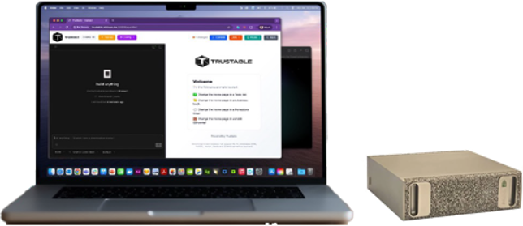
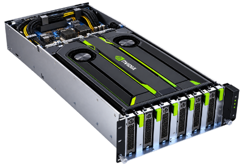
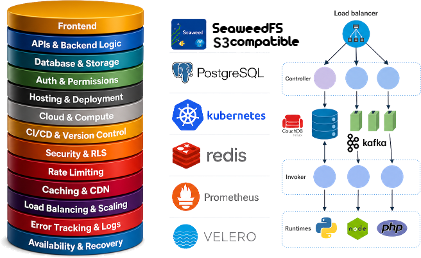
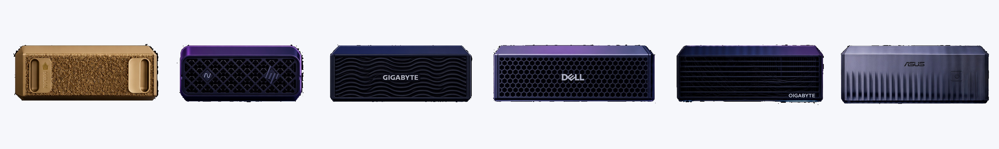

<!-- _class: lead -->

# IT is Trustable

## Build apps with prompts — on **AI you own**

Build, run and publish AI applications
that **never leave your own infrastructure**

---

## The Problem

Every AI development platform today asks you to make the same trade.

- To build with AI, you **send your code and your data** to someone else's cloud
- For regulated industries, defence, healthcare and public administration, that is **not an option**
- The alternative has been to **give up the AI experience entirely** and build by hand

### The result

Organizations that most need AI leverage are the ones least able to use it.

---

<!-- _class: lead -->

# The Solution

## Build apps with prompts, using **Local AI**, on a **full stack environment**

The model runs on your hardware. The stack runs on your hardware.
Nothing ever leaves your machine.

---

## Build Apps with Local AI on your PC

Customize and build **full stack applications with prompts**, using Local, Private or Sovereign AI.

Describe what you want and Trustable writes it — **frontend, backend actions and data wiring** — and runs it on the stack it ships with.

It is Nuvolaris technology *inside* the platform, not a third-party tool: what it builds runs on your own stack, on your own hardware.

**No code or data leaves your infrastructure.**

---

## Start From Templates — NuvolarIA

**NuvolarIA is a set of applications**, not a single product — a catalog of ready-to-use apps shipped with the platform.

Pick one and customise it to your needs with the AI, instead of starting from scratch.

Mini CRM, project dashboards, API monitors, document and mail assistants — each one a real, deployable application rather than a demo.

 

*Applications built and running on Trustable*

---

## Deploy Anywhere

Deploy in your **private server** with a complete stack for AI.

From a desktop appliance, to a **GPU server in your own rack**, to a **sovereign data centre** — the same application, the same platform, no rewrite.

**Your server**

**Your data centre**

---

## A Complete Stack, Not a Component

Frontend, APIs, database and storage, hosting, compute, FAAS, security, rate limiting, caching, load balancing, logging and recovery.

**Kubernetes · S3 · PostgreSQL · Redis · Prometheus · Velero**

### Why this matters

Competitors sell a model or a UI. Trustable ships the **entire production stack** the application actually needs — which is why it can run somewhere that has no cloud at all.

---

## Scale Everywhere — Three Markets, One Platform

**Local AI**
*One desk*

The NuvolarIA appliance on your own desk. Your models and data never leave the machine.

**Private AI**
*One organization*

A GPU server in your own rack, serving whole teams behind your firewall.

**Sovereign AI**
*One nation*

A data centre operated as an AI provider, under your own jurisdiction.

---

## One Platform, Every Scale

The same application runs from a **laptop to a sovereign cloud**.

Customers enter at the tier they can afford today and grow into the next one — the platform, and the relationship, scales with them.

---

## What People Build

The high-value use cases are exactly the ones organizations **cannot** send to a public cloud: internal mail, customer records, confidential documents.

---

## Technology & Moat

- **Owned end to end.** The serverless engine, the platform services and the AI builder are Nuvolaris technology — not a wrapper over a third-party API
- **No vendor dependency.** No per-token cost to a model provider, and no upstream vendor who can change terms
- **Deployment is the product.** A complete, integrated, self-hosted stack is a years-long engineering effort
- **Open foundation.** Kubernetes and the CNCF ecosystem, so customers are never locked in

---

## Traction

**TODO — supply real figures before sending.** Customers and pilots, deployed appliances, revenue or ARR, pipeline, notable logos, community or download numbers.

**TODO — Team.** Founders, relevant background, key hires, advisors.

**TODO — Business model.** Appliance sale, platform licence, support subscription, per-node pricing.

---

## The Ask

**TODO — supply before sending.** Amount raised, round type, use of funds, key milestones this round buys, current investors.

---

<!-- _class: lead -->

# IT is Trustable

## Build with AI. **Keep your data.**

[trustable.it](https://trustable.it) · [trustable.it/documentation](https://trustable.it/documentation/)
